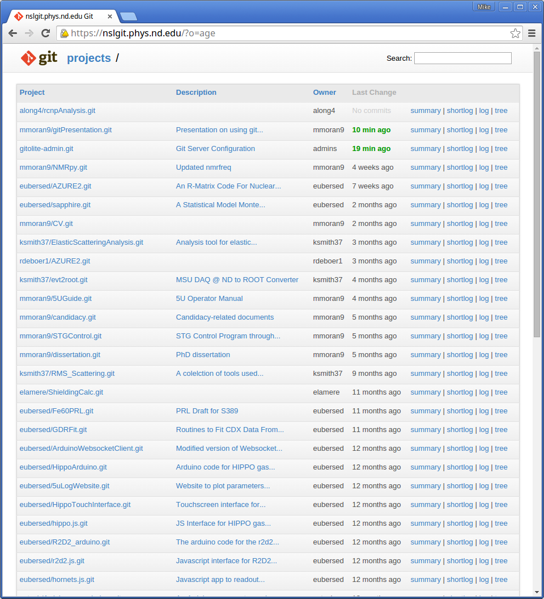

# GIT@NSL

Mike Moran

28 April 2015

!

## Why?

- Lightweight version control software
- Safety button for accidental deletes
- Collaboration on large projects
- Doomsday Vault for your code
- Don't need an internet connection

*You should version-track any plaintext that you are changing or may change in the future!*

!

## Where?

Local computer

- GUI or CL

CRC machine: `module load git`

External repository

- GitHub, BitBucket, nslgit.phys.nd.edu

Check out [http://git-scm.com/downloads/guis](http://git-scm.com/downloads/guis) for non-Terminal clients

!

## Repositories are your friend

"...on-disk data structure which stores metadata for a set of files and/or directory structure."

Contains all the "stuff" for a single project

- Paper in work (.tex and figures)

- Analysis code (.cpp, .h, .py)

!

## How?

```
$ git init
$ git add *
$ git status
$ git commit -m "commit message"
```
...or...

```
$ git clone REPONAME
```

!


!

## Setting up git

Git will ask you for information, or you can manually create a `.gitconfig` file

```
[user]
  email = mmoran9@nd.edu
  name = Mike Moran
  editor = vim
[url "https://nslgit.phys.nd.edu/"]
  insteadOf = nsl:
[url "git@nslgit.phys.nd.edu:"]
  insteadOf = nslssh:
```

!

## Ignore this

Some files you don't want to include (binaries)

Create a `.gitignore` in your repo

```
*.so
*.d
*.pyc
```

!

## Going straight to the Server

```
git clone nsl:netID/repo
git clone nslssh:netID/repo
```

Will create empty repository named `repo` on your computer and `netID/repo` on NSL's git server


!

## Getting it to the Server

`git push nsl:netID/repo master`



!

## Updating in either direction

Changes to your local copy you want to save?

- `git push`

Changes on the Server you want to get?

- `git pull`

!

## Getting a different project

```
git clone nsl:netID/repo
```

Automatically sets remote for you: easier pushes and pulls

Need to be given access by repo owner...

!

# QUIZ TIME

Get this presentation (`gitPresentation`) from the NSL git server

Add your netID to the file `TRAINING`, commit those changes, and push them back to the server

!

## SSH Commands

Change who can see/edit repository

- `ssh git@nslgit.phys.nd.edu perms netID/repo + ROLE netID`

- two different roles: `READERS` and `WRITERS`

- use `@nsl` for netID if you want everyone to see it

Check that it worked:

- `ssh git@nslgit.phys.nd.edu perms -l netID/repo`

!

## Branching and Merging

Already encountered merging: happens when two (or more) people make separate changes

- git handles this automatically, except when merge is exceedingly complex

Get around this with branching

!

## Basic Branch Commands

`git branch` to view

`git checkout -b BRANCH` to create and immediately switch to a separate branch

`git checkout BRANCH` to switch to previously-created branch

`git merge BRANCH` to combine BRANCH with your current branch

!

## More Information

[Git Reference](http://gitref.org)

[NSL XWIKI](https://xwiki.phys.nd.edu/bin/view/Computing+Information/Using+the+NSL+Git+Server)

`git help` or `git help cmd` or `man git`

!

## Troubleshooting

Need to load NSL modules first if on CRC

* `module load /afs/crc.nd.edu`
  `/user/n/nsl/nuclear/startup/nsl`

HTTP Error on CRC? Load updated git

* `module load git`
