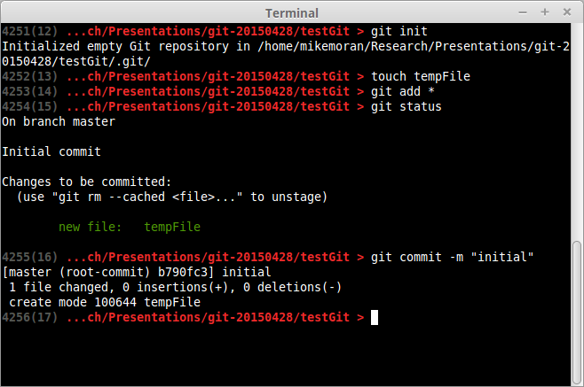

# GIT@NSL

Mike Moran

28 April 2015

!

## How?

```
$ git init
$ git add *
$ git status
$ git commit -m "commit message"
```
...or...

```
$ git clone REPONAME
```

!



!

## Ignore this

Some files you don't want to include (binaries)

Create a `.gitignore` in your repo

```
*.so
*.d
*.pyc
```

